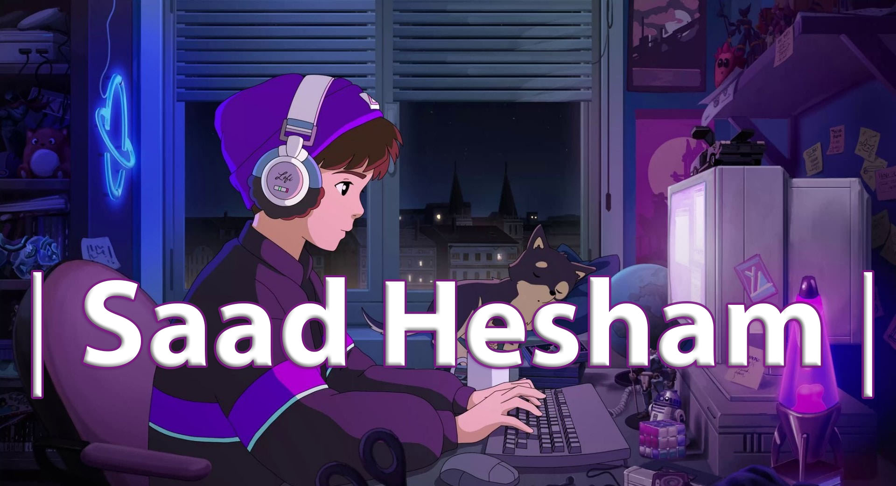

<h5 align="center">
  Hey! 👋 I'm Saad Hisham, a Front End Development enthusiast. I'm determined to master both Front End and Back End Development 😈
  When I'm not coding, I enjoy gaming 🎮, anime 📺, reading novels 📖, and coffee ☕️ My colleague studies law, but I'm happy to pursue my coding passion!
</h5>

  

    
  

  - 🔭 I'm currently working on **Landing my first job**
  - 🌱 I'm currently learning **ASP.NET**
  - 📫 How to reach me: **saadhesham626@gmail.com**

<h3 align="left">Languages and Tools:</h3>

  
  
  
  
  
  
  
  
  
  
  

