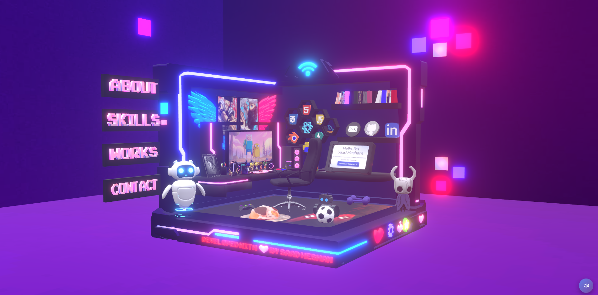
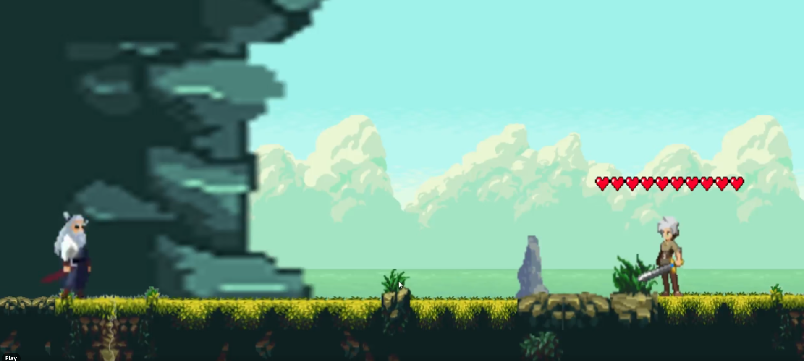

  

<h1 align="left">Hey 👋 I'm Saad Hisham</h1>

<h3 align="left">Front-End Developer | 3D Web Enthusiast | Future Full-Stack Developer 😈</h3>

  

---

## 🚀 About Me

* 💻 Passionate about **Front-End Development and 3D Web Experiences**
* 🎯 Goal: Become a **Full Stack Developer**
* 🌱 Currently learning **Python and Backend Development**
* 🎮 Gaming lover
* 📺 Anime fan
* 📖 Novel reader
* ☕ Coffee addict
* 🔥 I love building interactive and modern web apps

📫 **Reach me at:** [saadhesham626@gmail.com](mailto:saadhesham626@gmail.com)

---

## 🛠️ Languages and Tools

  

  

---

## ⭐ Favorite Repositories

<table align="left">
<tr>
<td align="left" width="50%">

### 🏠 3D Room Portfolio

 

Interactive 3D portfolio built using React and Blender.

</td>

<td align="left" width="50%">

### 🥷 Shinobi Clash Game

 

Anime-style browser fighting game built with JavaScript.

</td>
</tr>
</table>

---

## 📊 GitHub Stats

  

  

  

---

## 🌐 Connect With Me

  
  

---

  💚 Built with passion, coffee, and late-night coding

